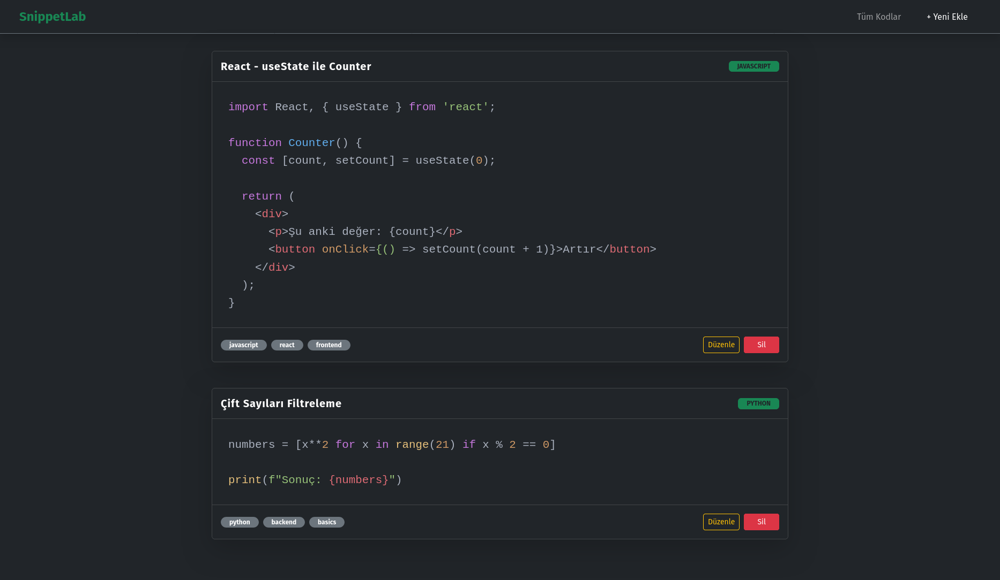
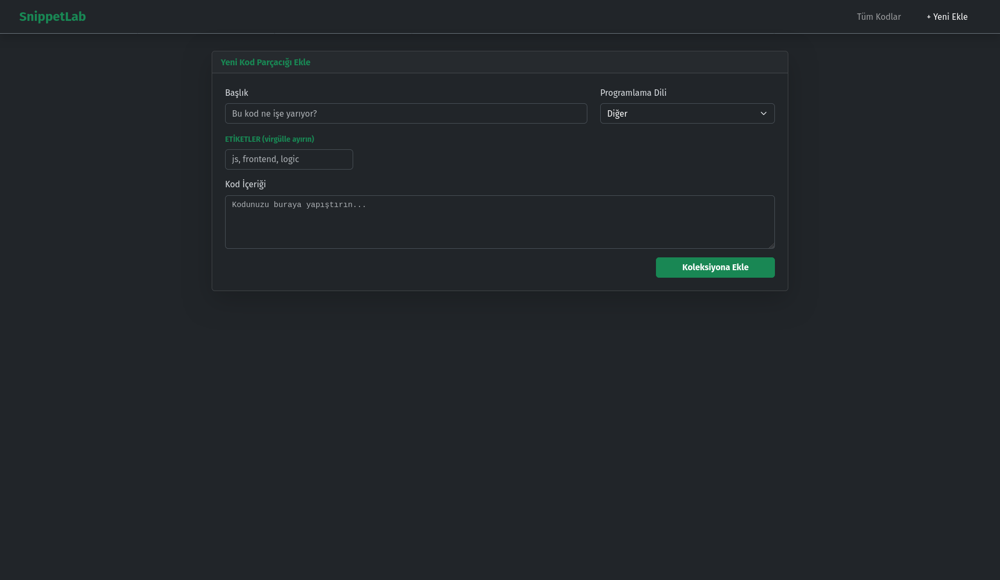

## SnippetLab
**SnippetLab**, geliştiricilerin sık kullandığı kod parçacıklarını kategorize ederek saklayabileceği, modern ve hızlı bir web uygulamasıdır.

## Özellikler
- **Tam CRUD Desteği:** Kod parçacıklarını ekleyin, listeleyin, güncelleyin ve silin.
- **Syntax Highlighting:** Çoklu dil desteği ile kodlarınızı renklendirilmiş şekilde görüntüleyin (JS, Python, C, C++, Go, vb.).
- **Yerel Depolama (LocalStorage):** Verileriniz tarayıcınızda saklanır, sayfayı yenileseniz bile kaybolmaz.
- **Responsive Tasarım:** Bootstrap 5 ve Dark Mode desteği ile tüm cihazlarda şık görünüm.
- **Modüler Mimari:** React Custom Hooks ve bileşen tabanlı temiz kod yapısı.

## Kurulum
Projeyi yerel bilgisayarınızda çalıştırmak için şu adımları izleyin:
1. Depoyu klonlayın:
```bash
git clone https://github.com/nhrx-temp/SnippetLab.git
cd SnippetLab
```

2. Bağımlılıkları yükleyin:
```bash
npm install
```

3. Çalıştırma ve Derleme:
- **Geliştirme Modu:** Uygulamayı hot-reload ile başlatır.
```bash
npm run dev
```
- **Yayın Hazırlığı (Build):** Uygulamayı optimize eder ve dist/ klasörüne yayına hazır statik dosyaları çıkarır.
```bash
npm run build
```
- **Önizleme:** Derlenmiş (build alınmış) projeyi yerelde test etmenizi sağlar.
```bash
npm run preview
```

## Kullanılan Teknolojiler
- **React 19** (Vite altyapısı ile)
- **Bootstrap 5** (React-Bootstrap)
- **React Syntax Highlighter**
- **Custom Hooks**

## Proje Yapısı
```text
src/
├── components/    # Tekrar kullanılabilir arayüz bileşenleri (Card, Form, Nav)
├── pages/         # Sayfa seviyesindeki bileşenler (Listeleme, Oluşturma)
├── hooks/         # Veri mantığını (logic) içeren Custom Hook
├── data/          # Sabit veriler
└── App.jsx        # Ana uygulama giriş noktası ve yönlendirme
```

## Ekran Görüntüleri
<p align="center">
  
  
</p>
